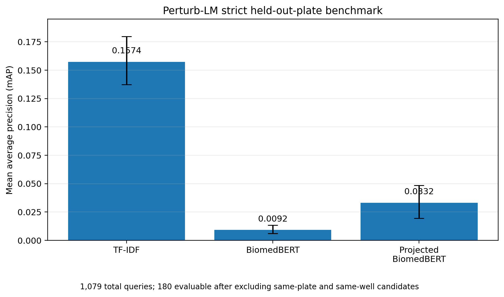
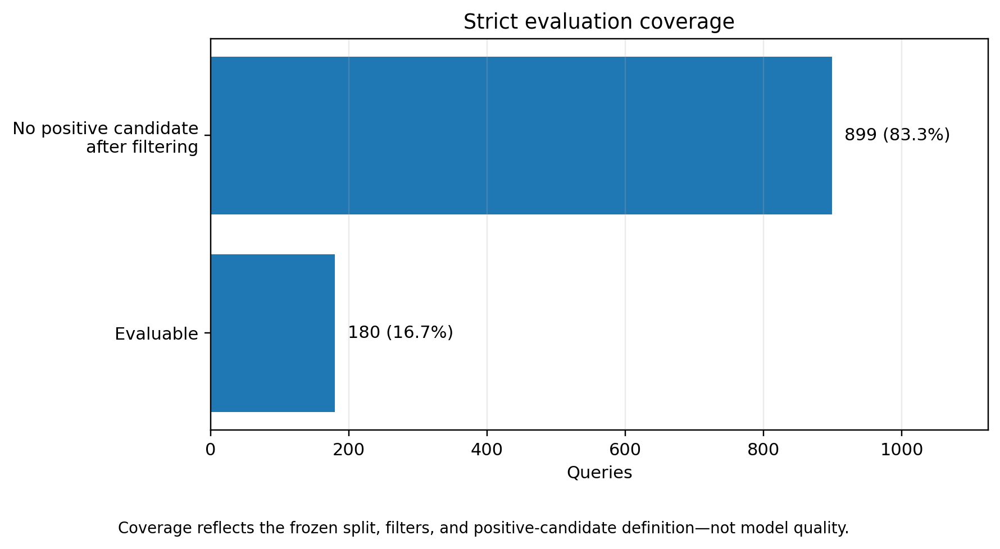
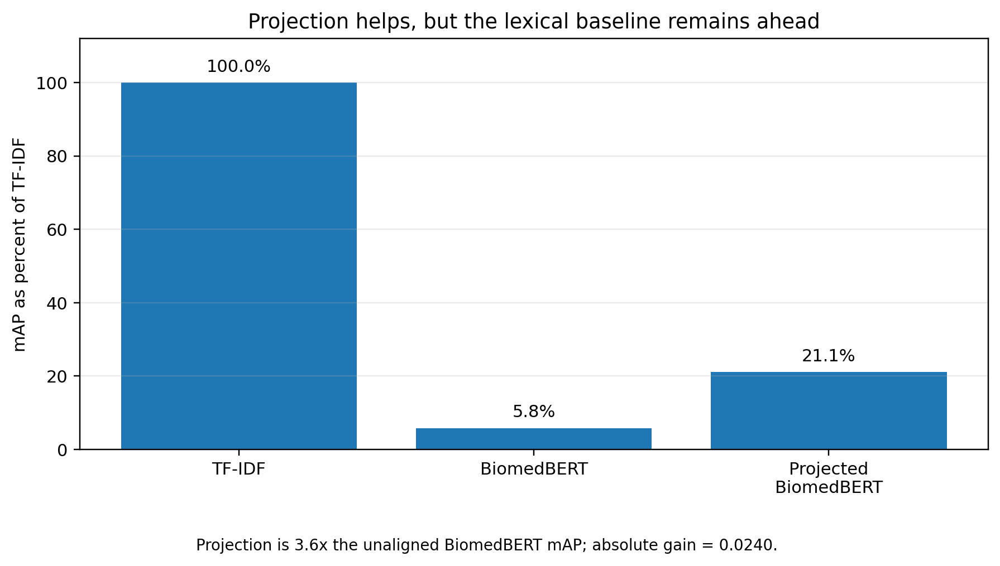

# Biowulf strict benchmark reproduction

**Run date:** 2026-09-10
**Public update date:** 2026-09-11
**Perturb-LM source commit:** `551e98280793a1e1beefae282900b12bb586201a`

## Evaluation contract

The reproduced primary condition uses:

- split: `held_out_plate`;
- retrieval filter: `exclude_same_plate_and_well`;
- model-visible query condition: identifier-stripped M0 text;
- morphology representation: the existing 904-feature CPJUMP1 profile space;
- train-only preprocessing and ridge fitting for the projected dense model;
- the same candidate pool, relevance definition, metrics, and query bootstrap across methods.

## Verified result

| Method | mAP | 95% query-bootstrap CI | Total queries | Evaluable queries |
| --- | ---: | ---: | ---: | ---: |
| Identifier-stripped TF-IDF | 0.157407 | 0.137431–0.179733 | 1,079 | 180 |
| BiomedBERT, unaligned | 0.009196 | 0.005982–0.013334 | 1,079 | 180 |
| BiomedBERT, train-only ridge projection | 0.033156 | 0.019586–0.048473 | 1,079 | 180 |

The projected BiomedBERT representation improved approximately 3.61-fold over the unaligned dense representation, but reached only 21.1% of the TF-IDF point estimate. The absolute gap between projected BiomedBERT and TF-IDF was 0.12425 mAP.

Only 180 of 1,079 queries remained evaluable after strict filtering, corresponding to 16.7% coverage. The remaining 899 queries had no positive candidate under this contract. This coverage loss is a result that must be reported alongside mAP.

## Interpretation

This experiment does **not** establish that TF-IDF understands biology better. It establishes that this specific frozen BiomedBERT representation plus train-only linear alignment did not outperform the identifier-stripped lexical control under the reproduced strict condition.

The result motivates two next steps:

1. test retrieval-trained or semantics-oriented biomedical encoders under the identical evaluator; and
2. audit whether performance depends on model-visible text, upstream image/profile preprocessing, experimental grouping metadata, or evaluation-only metadata.

## Keep this separate from the foundation lexical benchmark

The repository also records a 641-query foundation lexical benchmark with identifier-stripped TF-IDF mAP 0.2513. That global lexical result and the strict 1,079-total/180-evaluable result are different evaluation populations and must not be compared as if they were the same condition.

## Public artifact policy

This document contains only aggregate, public-safe results. Raw profiles, row-level predictions, embeddings, indexes, model weights, internal filesystem paths, hostnames, credentials, and scheduler identifiers are intentionally excluded.

## Figures

