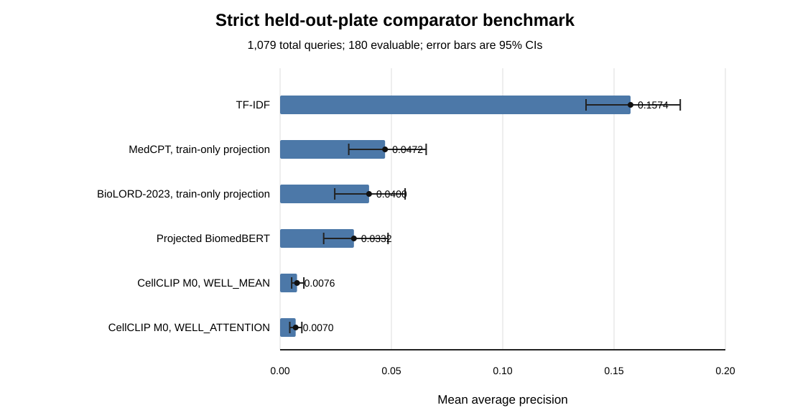

# Experimental Background, Metadata Semantics, and Information Boundaries

**Status:** primary M0 comparator benchmark complete, 2026-09-12.

## Purpose

Perturb-LM tests whether biomedical and multimodal representations retain useful
language-to-morphology retrieval signal after lexical and experimental shortcuts
are controlled.

A central issue is that **metadata does not mean the same thing across the
compared methods**. This document therefore keeps two vocabularies separate:

1. **Source-author terminology:** what the original paper or implementation
   calls text, metadata, labels, annotations, experimental metadata, ontology
   information, search-log information, etc.
2. **Perturb-LM causal classification:** what role that information actually
   plays in the current experiment.

The same database field can change classification depending on how it is used.
For example, `Cell_type` is experimental metadata while stored in a table, but
it becomes **MODEL_VISIBLE** semantic information when inserted into a CellCLIP
prompt.

This distinction is necessary for fair comparator interpretation.

## Frozen comparison contract

The primary benchmark keeps the following fixed across applicable comparators:

- split: `held_out_plate`
- retrieval filter: `exclude_same_plate_and_well`
- test queries/candidate profiles: 1,079
- evaluable queries after leakage filtering: 180
- seed: 0
- relevance: exact treatment identity
- model-selection rule: no tuning against the held-out test to make a
  comparator win

The information boundary, rather than the implementation architecture, is the
main fairness constraint.

## Perturb-LM causal-role classification

| Class | Definition | Example |
| --- | --- | --- |
| `MODEL_VISIBLE` | Literal information consumed by the model for the current sample | M0 text, CellCLIP cell type or SMILES when inserted into a prompt, image pixels |
| `INPUT_SHAPING` | Rules or values that alter model input without being supplied as tokens/features | intensity clipping, bit-depth conversion, channel order, crop rules |
| `GROUPING_JOIN` | Identifiers used to associate records/images or determine pooling | plate, well, site |
| `SUPERVISION_LABEL` | Information defining positives, targets, pairings, or answer labels | exact treatment identity used for relevance |
| `EVALUATION_ONLY` | Information used for split construction, candidate filtering, or scoring | held-out plate and same-well/same-plate filters |
| `AUDIT_ONLY` | Provenance needed for reproducibility but causally invisible to the model | hashes, immutable revisions, source manifests |
| `MODEL_STATE_PRIOR` | Knowledge incorporated into released weights during pretraining rather than supplied per CPJUMP sample | PubMed knowledge, biomedical ontology/definition knowledge |
| `DERIVED_REPRESENTATION` | Features or embeddings computed from primary inputs | 904-D morphology profile, DINO embeddings, CellCLIP 512-D representation |

These labels are **Perturb-LM audit labels**, not claims that every source paper
uses these exact terms.

## Artifact-provenance states

Each important artifact should additionally be marked as one of:

- `PROVIDED`: directly released by the source project/dataset.
- `REGENERATED`: recreated by following a released method or pipeline.
- `DERIVED`: newly computed from provided/regenerated artifacts.
- `MISSING_NOT_PROVIDED`: described or implied but not present in the released
  materials inspected for this experiment.

Causal role and provenance are separate dimensions.

---

## TF-IDF

### Source-author/native meaning

TF-IDF is a controlled lexical baseline rather than a separate pretrained
biomedical model. There is no meaningful source-team concept of CPJUMP
"metadata" beyond the text that Perturb-LM supplies.

### Perturb-LM information boundary

- identifier-stripped M0 biological text: `MODEL_VISIBLE`
- treatment identity: `SUPERVISION_LABEL`
- plate/well/batch: `EVALUATION_ONLY`
- TF-IDF vector: `DERIVED_REPRESENTATION`

Its retrieval score can only depend directly on characters retained in M0.

---

## BiomedBERT

### Source-author/native meaning

BiomedBERT is pretrained biomedical language modeling over biomedical text.
Its PubMed/PMC-derived biomedical knowledge is part of the released model state,
not per-row CPJUMP metadata.

### Perturb-LM information boundary

- M0 query text: `MODEL_VISIBLE`
- biomedical knowledge encoded during pretraining: `MODEL_STATE_PRIOR`
- treatment identity: `SUPERVISION_LABEL`
- plate/well/batch: `EVALUATION_ONLY`
- train-only ridge projection, when used: `DERIVED_REPRESENTATION`

Projection changes alignment to morphology; it does not expose additional
metadata.

---

## MedCPT

### Source-author/native meaning

MedCPT is a biomedical retrieval model trained around query/article retrieval
behavior. The relevant source concepts are queries, articles, relevance/click
relationships, and retrieval training rather than Cell Painting experimental
metadata.

### Perturb-LM information boundary

- M0 query supplied to the query encoder: `MODEL_VISIBLE`
- knowledge acquired from biomedical retrieval pretraining:
  `MODEL_STATE_PRIOR`
- original query/article and click-derived relationships: part of the
  checkpoint's pretraining history, not CPJUMP row metadata
- treatment identity: `SUPERVISION_LABEL`
- plate/well/batch: `EVALUATION_ONLY`
- train-only ridge alignment: `DERIVED_REPRESENTATION`

Therefore MedCPT should not be described as receiving additional CPJUMP
metadata merely because its weights encode retrieval-specialized biomedical
knowledge.

---

## BioLORD-2023

### Source-author/native meaning

BioLORD is organized around biomedical concepts, concept names, definitions,
ontology/knowledge-graph relationships, and definition-based representation
learning.

### Perturb-LM information boundary

- M0 query: `MODEL_VISIBLE`
- definition/ontology/concept knowledge incorporated in the released model:
  `MODEL_STATE_PRIOR`
- treatment identity: `SUPERVISION_LABEL`
- plate/well/batch: `EVALUATION_ONLY`
- train-only ridge alignment: `DERIVED_REPRESENTATION`

No UMLS, SNOMED, definition, synonym, or ontology lookup is performed for an
individual CPJUMP test query in the M0 experiment. Such a lookup would create a
different metadata-exposure condition.

---

## CellCLIP

CellCLIP requires the most explicit metadata treatment because the released
workflow describes preprocessing Cell Painting images **and associated
metadata**, and its caption construction turns experimental/perturbation
annotations into model-visible language.

### Source-author/native metadata concepts

The released CPJUMP preprocessing code reads experiment metadata and
perturbation-specific plate maps. Published-style caption construction uses
fields including:

- cell type
- perturbation class
- compound/perturbation identity (`pert_iname` or equivalent)
- SMILES for compounds
- gene identity for genetic perturbations
- target sequence when available
- control information when relevant

These fields are not equivalent to plate/well/site bookkeeping: once inserted
into the caption they become literal text tokens available to the model.

### M0 condition

The Perturb-LM primary CellCLIP comparator intentionally supplies the same
identifier-stripped biological-description policy used for the other M0
comparators.

Consequently:

- M0 text: `MODEL_VISIBLE`
- raw/preprocessed fluorescence pixels: `MODEL_VISIBLE`
- cell type / perturbation identity / SMILES / gene / sequence:
  **not exposed in M0**
- plate/well/site: `GROUPING_JOIN` and/or `EVALUATION_ONLY`
- preprocessing thresholds/order/crop rules: `INPUT_SHAPING`
- DINO embeddings and CellCLIP image representation:
  `DERIVED_REPRESENTATION`

The M0 score must therefore be described as:

> **CellCLIP under identifier-stripped metadata exposure**

rather than as an unrestricted statement about published CellCLIP performance.

### PUBLISHED condition

`PUBLISHED` is a separate secondary ablation intended to reproduce the
metadata-rich information boundary of the released CellCLIP captioning logic.

Fields textualized into a published-style prompt become `MODEL_VISIBLE`.

This experiment must remain separate from M0 because it deliberately changes
the information supplied to the model.

As of 2026-09-12, `PUBLISHED` remains pending until the authoritative CPJUMP1
experiment/perturbation metadata required to reconstruct those prompts are
resolved and provenance-locked. CSV files bundled with the inspected CellCLIP
checkpoint belong to a different released dataset/plate namespace and are not
silently substituted for CPJUMP1 metadata.

---

## Prompt-exposure ladder

Perturb-LM uses an explicit exposure ladder:

| Condition | Information exposed |
| --- | --- |
| `M0` | canonical identifier-stripped biological description only |
| `M1` | M0 + cell type |
| `M2` | M1 + perturbation class |
| `M3` | M2 + drug/gene identity |
| `M4` | M3 + SMILES or target sequence |
| `M5` | M4 + batch/plate/well/site; leakage-positive-control condition only |
| `PUBLISHED` | exact source-model prompt policy; reported separately from M0 |

The ladder measures information exposure, not model quality.

---

## CPJUMP acquisition and experimental metadata

CPJUMP contains several categories of information that are often all casually
called "metadata":

### Acquisition / experimental context

Examples include:

- batch
- plate
- well
- site
- fluorescence channel
- cell type / cell line
- perturbation class
- treatment identity
- treatment time or timing fields
- density / culture conditions
- acquisition anomalies or image-count fields when available

Their Perturb-LM class depends on use. A plate ID used to join images is
`GROUPING_JOIN`; the same plate ID used to remove leakage is
`EVALUATION_ONLY`; if deliberately inserted into a text prompt it would become
`MODEL_VISIBLE`.

### Perturbation annotation

Examples include:

- compound name
- gene identity
- SMILES
- target sequence
- control status

These are annotations while stored in metadata tables. They become
`MODEL_VISIBLE` only if the comparator receives them.

---

## Image/process-lineage metadata

Process-lineage state is kept separate from semantic metadata.

For the CellCLIP adaptation, the audited image path is:

raw TIFF
→ five fluorescence channels
→ high-intensity clipping at 0.0028 percent
→ 16-bit to 8-bit scaling
→ source-channel ordering
→ deterministic crops
→ frozen DINOv2 per-channel/site embeddings
→ site/well aggregation
→ CrossChannelFormer
→ normalized 512-D image representation
→ cosine-equivalent image/text similarity
→ frozen Perturb-LM evaluator

Important process-lineage items are classified as `INPUT_SHAPING` rather than
semantic `MODEL_VISIBLE` metadata.

For the morphology-profile comparator path, object segmentation,
measurements, well aggregation, normalization, and feature selection produce
the current 904-feature well profile. That final profile is a
`DERIVED_REPRESENTATION`.

---

## Why CellCLIP pooling is restricted to a well

Perturbation identity may act both as semantic information and as a grouping
key in multimodal training pipelines.

Perturb-LM freezes the individual test well/profile as the candidate unit.
Therefore CellCLIP image pooling is restricted to site images belonging to
that candidate well.

Pooling different wells because they are already known to share a treatment
would use answer-side information to construct the candidate representation
and would violate the frozen evaluation boundary.

Both sensitivity conditions are retained:

- `WELL_MEAN`
- `WELL_ATTENTION`

Neither pools across treatment-matched wells.

---

## Primary strict results

All primary M0 results use 1,079 total test queries and 180 evaluable queries.

| Method | mAP | 95% CI |
| --- | ---: | ---: |
| Identifier-stripped TF-IDF | 0.157407 | 0.137431–0.179733 |
| MedCPT, train-only projection | 0.047166 | 0.030828–0.065623 |
| BioLORD-2023, train-only projection | 0.039978 | 0.024538–0.056171 |
| Projected BiomedBERT | 0.033156 | 0.019586–0.048473 |
| BioLORD-2023, unaligned | 0.017703 | 0.008486–0.030943 |
| BiomedBERT, unaligned | 0.009196 | 0.005982–0.013334 |
| MedCPT, unaligned | 0.009152 | 0.005136–0.015074 |
| CellCLIP M0, WELL_MEAN | 0.007622 | 0.005193–0.010682 |
| CellCLIP M0, WELL_ATTENTION | 0.007000 | 0.004365–0.009778 |

<!-- STRICT_COMPARATOR_FIGURE_BACKGROUND_20260912 -->

The CellCLIP M0 result does **not** establish that published CellCLIP is
generally ineffective. It establishes that the released representation does
not transfer successfully under this identifier-stripped information boundary
and frozen strict evaluator.

The canonical TF-IDF CI is retained from the previously recorded strict
benchmark. Comparator-specific runs must record their own bootstrap sample
counts rather than silently replacing the canonical baseline interval.

---

## Interpretation rule

Perturb-LM therefore does not report a single binary field called
`uses_metadata`.

For every comparator and condition, report:

1. what the source authors call the information;
2. where the information originated;
3. whether the current model can directly observe it;
4. the Perturb-LM causal class;
5. the scale at which it operates;
6. whether changing/removing it can alter the model input;
7. its artifact provenance state.

The machine-readable companion table is:

`docs/data/comparator_metadata_roles_2026-09-12.tsv`

The procedural provenance/preprocessing checklist remains in:

`docs/METADATA_AND_PREPROCESSING_AUDIT.md`
